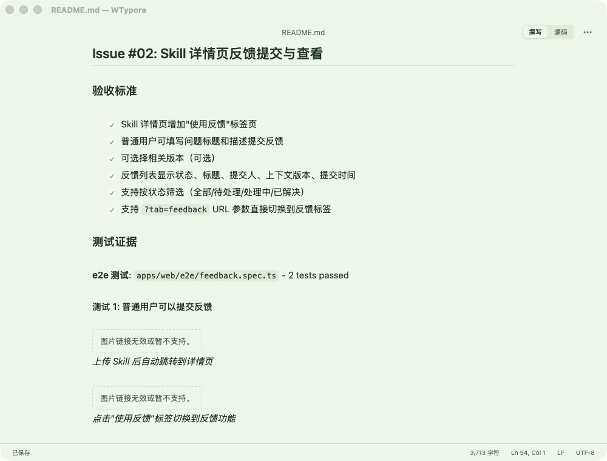
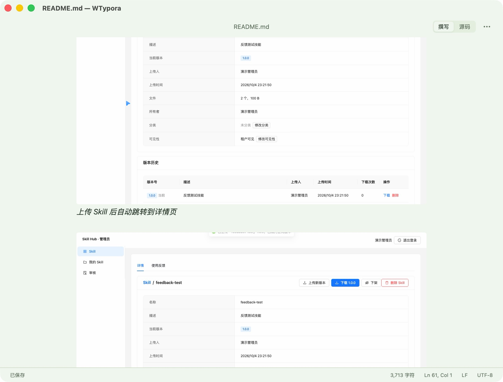
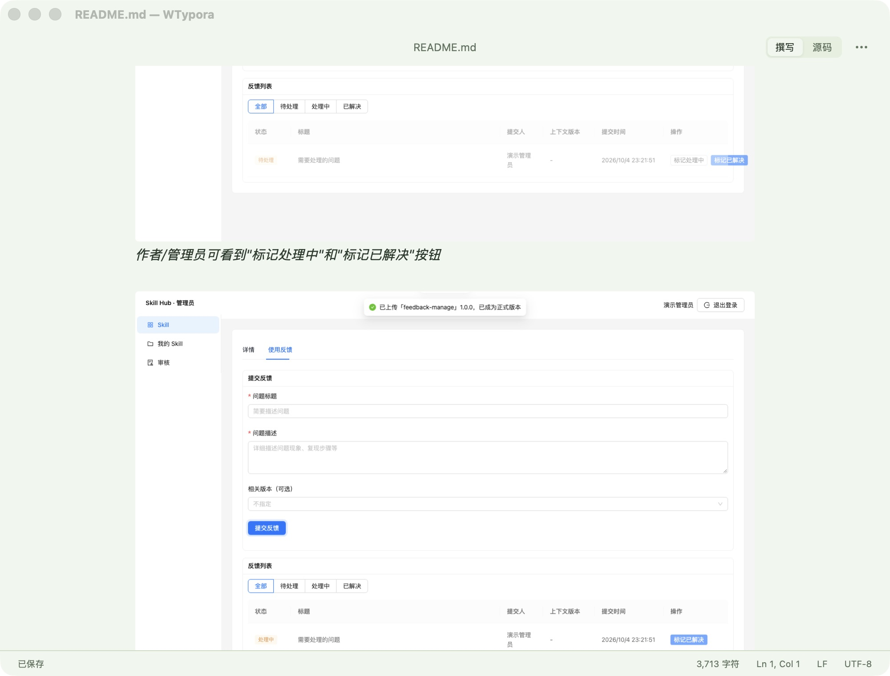

# 撰写模式本地图片支持 测试报告

## 一、基本信息与结论

| 项目 | 内容 |
| --- | --- |
| 任务 / Issue | 用户反馈在 WTypora 中打开 `skill-hub-teaching/docs/test-reports/feedback/README.md` 时全部 13 张图片显示"图片链接无效或暂不支持"；GitHub Issues 无对应工单 |
| 代码分支与测试版本 | `main`，HEAD `b960858`（领先 origin/main 1 个提交，为仓库既有状态）；工作区含大量既有未提交功能改动，本次改动在其上叠加，见"改动范围" |
| 测试日期 | 2026-10-04 23:45–24:00 CST |
| 测试环境 | macOS（arm64）、Node 26、Rust 1.98、Tauri 2.11、vitest 5、Playwright（chromium+webkit）、已安装旧版 `/Applications/WTypora.app` |
| 测试范围 | BUG-01 撰写模式本地/相对路径图片不渲染；回归：远程图片、拦截策略、导出、全部既有套件 |
| 测试结论 | 通过。源码测试全部通过；已安装新版本实机验证 13 张本地图片全部渲染，签名身份与旧版兼容 |

## 二、Bug 与验收标准对照

| Bug 编号 | 原始症状 | 预期行为 / 验收标准 | 验证方式 | 结果 |
| --- | --- | --- | --- | --- |
| BUG-01 | 打开含相对路径图片的 Markdown，撰写模式显示"图片链接无效或暂不支持。"占位符，13 张图片全部不渲染 | 相对路径按当前文档所在目录解析并渲染；支持 `./`、`../`、百分号转义、`file://`、绝对路径；未保存文档的相对图片、丢失文件、超限文件显示加载失败提示；`javascript:`、`data:`、带凭据 URL 保持拦截 | T-01～T-06 单元/组件测试、T-07 Rust 命令测试、V-01 安装后实机验证 | 源码级通过；实机验收见第六节 |

## 三、根因（已验证）

`apps/desktop/src/components/MarkdownPreview.tsx` 的 `MarkdownImage` 仅接受 `http(s)` 且无凭据的 URL，相对/本地路径落入兜底分支渲染占位符；代码注释、README 与既有测试均将其记录为"尚未支持"。`MarkdownContent` 经 `renderToStaticMarkup` 输出静态标记，无法在渲染时同步读取本地文件，且渲染层拿不到文档路径与 native bridge——这是缺口而非笔误。修复需在渲染后按文档目录异步解析本地图片。

## 四、改动范围

本次任务新增/修改（其余工作区改动为既有未提交内容，不归属本任务）：

- `apps/desktop/src-tauri/src/images.rs`（新增）：`read_local_image` 命令，相对路径按文档目录解析（Url join 处理 `./`、`../`、`%20`），校验图片扩展名、单文件 20 MB 上限后读字节返回 `{bytes, mime}`；命令边界复查 scheme，仅接受 file/绝对/相对路径。
- `apps/desktop/src-tauri/src/lib.rs`：注册 `mod images` 与命令。
- `apps/desktop/src/editor/localImages.ts`（新增）：模块级加载器注册、data URL 构建、按 `文档路径|source` 键控的缓存（上限 50 条，失败不缓存）。
- `apps/desktop/src/components/MarkdownPreview.tsx`：本地路径渲染 ``（不带 src，不发起请求）；`file:` 之外仍走 react-markdown 默认 URL 审查。
- `apps/desktop/src/editor/liveMarkdown.tsx`：挂件挂载后对 `data-local-src` 图片异步解析并回填 src，失败派发 error 事件显示提示。
- `apps/desktop/src/native/bridge.ts` / `fakeBridge.ts`：`readLocalImage` 桥接与测试替身。
- `apps/desktop/src/document/controller.ts`：构造时注册绑定本窗口 bridge 与当前会话路径的加载器，dispose 时清除。
- 测试：`src/editor/localImages.test.tsx`（新增）、`src/components/MarkdownPreview.test.tsx`（更新本地路径用例）、`images.rs` 内嵌 Rust 测试。
- `README.md`：更新"本地和相对路径图片暂不支持"描述。

## 五、自动化测试结果

| 用例 | 类别 | 执行命令 | 预期 | 实际 | 状态 |
| --- | --- | --- | --- | --- | --- |
| T-01 localImages 集成（3 例：相对图渲染为 data URL、读取失败显示提示、远程图不经本地加载器） | 本次回归 | `npx vitest run src/editor/localImages.test.tsx` | 3 通过 | 3 通过 | 通过 |
| T-02 MarkdownPreview 组件（拦截 3 例 + 本地延迟加载 5 例 + 远程引用 1 例） | 本次回归+既有更新 | `npx vitest run src/components/MarkdownPreview.test.tsx` | 9 通过 | 9 通过 | 通过 |
| T-03 前端全量 | 既有套件 | `npx vitest run` | 全部通过 | 17 文件 122 用例全部通过 | 通过 |
| T-04 Rust 命令（相对解析、%20、绝对/file://、无文档拒绝、缺失/格式拒绝、scheme 与 20MB 上限） | 本次回归 | `cargo test -p wtypora-desktop images` | 6 通过 | 6 通过 | 通过 |
| T-05 Rust 工作区全量 | 既有套件 | `cargo test` | 全部通过 | 23+6+5+1+14 通过，0 失败 | 通过 |
| T-06 typecheck + lint | 既有套件 | `npm run typecheck && npm run lint` | 无错误 | 无错误 | 通过 |
| T-07 e2e 全量 chromium+webkit | 既有套件 | `npx playwright test` | 全部通过 | 46 通过、2 跳过（opt-in 性能基线） | 通过 |

修复前基线：T-01/T-02 新用例在旧代码上 8 失败 4 通过（预期失败，证明回路可捕获本 Bug）。安装前实机基线见下图：旧版打开同一份文档，图片位置显示"图片链接无效或暂不支持。"。

图 1：BUG-01 修复前，已安装旧版打开 `skill-hub-teaching/docs/test-reports/feedback/README.md`，13 处图片均显示"图片链接无效或暂不支持。"占位符（窗口 1000×760，截取 Issue #02 段落）。

## 六、构建、安装与启动验收

| 检查项 | 状态与证据 |
| --- | --- |
| 构建与校验 | `npm run tauri build` 成功；产物 `target/release/bundle/macos/WTypora.app`（arm64，本次修改后源码）；`codesign --verify --deep --strict --all-architectures` 通过 |
| 签名与授权保留 | 沿用项目固定身份 `Apple Development: 605283073@qq.com (C7M68TN47R)`，Team `7PXD675DGC`，bundle id 不变；新产物满足旧版 designated requirement（`-R` 校验 explicit requirement satisfied）；entitlements 与旧版一致；安装后复查签名一致；启动及打开文件全过程无授权提示 |
| 旧进程退出 | 旧 PID 57577（`/Applications/WTypora.app/Contents/MacOS/wtypora-desktop`，已核对路径），文档无未保存修改，AppleScript 请求退出后 2 秒正常退出，无残留进程 |
| 安装 | 旧包移至临时备份 → 新包完整复制至 `/Applications/WTypora.app` → 校验通过后删除备份；未触碰用户数据与 TCC 记录 |
| 启动与功能 | `open -a /Applications/WTypora.app <原反馈 README>` 启动，新进程 PID 64265，可执行文件路径核对为安装副本，进程持续运行；原症状场景复测：13 张相对路径图片全部正常渲染（图 2、图 3） |
| 界面验收 | 已实际查看安装版窗口（1000×760 默认尺寸）：图片按编辑区宽度缩放渲染、无占位符、窗口四边与圆角正常、无裁切或异色块；点击图片块后状态栏显示 Ln 59, Col 1，光标进入图片所在块（点击编辑链路生效）；激活块显示源码的渲染状态由通过的 e2e `preview.spec.ts` 覆盖，验证过程中用户切换 Space，未单独截取该状态截图 |
| 条件联动 | CSP `img-src` 已含 `data:`，无需调整；`file:` 之外仍走 react-markdown 默认 URL 审查，远程图片 e2e（`images.spec.ts`）通过 |
| Git | 仓库存在大量既有未提交改动且本次无提交/推送授权，按项目现状保留工作区，未提交（见遗留事项） |

图 2：BUG-01 修复后，安装新版打开同一份文档的同一区域（Issue #02 测试 1），原占位符位置渲染出 `01-skill-detail.png`、`02-feedback-tab.png` 实际截图。

图 3：修复后 Issue #03 区域，多张相对路径截图（`05-feedback-actions-visible.png` 等）连续正常渲染。

## 七、遗留事项与验收建议

- 导出 Word/PDF 仍不嵌入本地图片（`apps/desktop/src/export/document.tsx` 按设计抛出"暂不支持本地图片"，导出时保留占位说明），README 相应描述保持不变；如需导出本地图片另立任务。
- 未保存的新文档（无路径）中的相对图片无法解析，显示加载失败提示，与 Typora 行为一致。
- 本地图片缓存以`文档路径|source`为键，文件在磁盘上被外部替换后不主动刷新（重新打开文档或切换模式后刷新）。
- 未单独截取"点击图片块后显示源码"的界面状态（验证过程中用户操作切换了 Space）；该交互由 e2e `preview.spec.ts` 用例覆盖且点击定位已在安装版实测生效。用户复查：在已安装的 WTypora 中打开含相对路径图片的文档，单击图片应显示其 Markdown 源码，点击他处恢复渲染。
- Git 交付：本次未提交；如需入库，请明确提交与推送范围（工作区含本任务之外的大量既有改动）。
