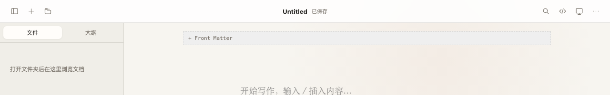

# 右上角更多菜单与编辑区顶部留白修复报告

- 日期：2026-09-04
- 状态：已修复、已打包、已安装并启动本机版本
- 分支：`main`
- 发布状态：已本地提交；`origin/main` 已不存在，未擅自重建或覆盖远端分支

## 问题概述

### 实际表现

1. 右上角三个点菜单虽然展示了“打开文件夹、保存、另存为、导出 HTML、打印或导出 PDF”，但浏览器环境下打开文件夹不可用，已打开文件的保存只写入内存，打印在 Tauri 中缺少 WebView 权限。
2. 无 YAML Front Matter 的文档仍显示 `+ Front Matter` 占位区；编辑器容器和 Milkdown ProseMirror 同时设置了较大的顶部内边距，导致第一行明显偏下。

### 期望表现

1. 五个菜单项都调用对应功能，并在点击后关闭菜单；浏览器环境下也能打开 Markdown 文件夹、保存、另存为和导出。
2. 普通文档直接从正文开始，不显示无意义的 Front Matter 区域；已有 Front Matter 的文档仍保留可视化编辑能力；正文第一行靠近顶部但保留舒适间距。

### 复现步骤

1. 启动应用，点击右上角三个点。
2. 依次点击菜单项；旧版本中浏览器“打开文件夹”无结果，保存已打开文件不产生下载，Tauri 打印权限不完整。
3. 新建一个没有 YAML Front Matter 的空文档。
4. 观察编辑区顶部存在 `+ Front Matter` 区域，正文占位文字距离标题栏过远。

### 影响范围

- 影响浏览器开发/预览环境中的文件夹打开、文件保存和导出体验。
- 影响 Tauri 版本的打印或导出 PDF 权限。
- 影响所有不含 Front Matter 的普通 Markdown 文档首屏空间利用率。

## 根因

1. `createBrowserNativeBridge()` 复用了内存桥接层的 `openWorkspace`、`readFile` 和 `writeFileAtomic`：文件夹选择始终返回 `null`，保存已打开文件只更新内存，没有触发浏览器下载。
2. `src-tauri/capabilities/default.json` 缺少 `core:webview:allow-print`，导致 WebView 打印 IPC 没有明确授权。
3. `VisualEditor` 在 Front Matter 不存在时仍渲染添加条；同时项目包装层顶部间距与 Crepe 默认 `.ProseMirror` 的 `60px` 顶部内边距叠加。

## 修复内容

1. 为浏览器桥接层增加真实的文件夹选择、Markdown 文件过滤、文件缓存读取、保存下载、另存为和 HTML 导出下载；保存时继续执行摘要冲突检查。
2. 为 Tauri WebView 增加打印权限，并通过测试锁定能力配置。
3. 删除无 Front Matter 时的添加占位区；已有 Front Matter 继续显示并可编辑。
4. 将视觉编辑器包装层顶部内边距降为 `0`，将正文顶部内边距固定为 `24px`，保留左右 `24px` 和底部空间。
5. 补齐五个菜单项的回调测试、浏览器文件夹/保存测试、Front Matter 缺省行为测试和编辑区间距契约测试。

## 关键文件

- `src/native/browserBridge.ts`
- `src/native/browserBridge.test.ts`
- `src/components/TitleBar.test.tsx`
- `src/editor/VisualEditor.tsx`
- `src/editor/editorContract.test.tsx`
- `src/editor/editorLayout.test.ts`
- `src/styles/app.css`
- `src-tauri/capabilities/default.json`
- `src-tauri/gen/schemas/capabilities.json`
- `src/app/tauriCapabilities.test.ts`

## 修复前后截图

截图条件：本地浏览器预览、浅色主题、空白 `Untitled` 文档、1280×720 视口，均裁取顶部 1280×200 区域。修复前截图来自修复前提交 `0f60917` 的当前状态截图并按相同区域裁切。

### 修复前

### 修复后

## 验证记录

| 验证项 | 命令或操作 | 结果 |
| --- | --- | --- |
| 前端测试 | `npm test -- --run` | 17 个测试文件、82 个测试全部通过 |
| 前端构建 | `npm run build` | 通过；仅保留既有的大 chunk 警告 |
| TypeScript | `npm run typecheck` | 通过 |
| ESLint | `npm run lint` | 通过 |
| Rust 测试 | `cargo test --manifest-path src-tauri/Cargo.toml --locked` | 16 个测试全部通过 |
| Rust 格式 | `cargo fmt --manifest-path src-tauri/Cargo.toml -- --check` | 通过 |
| Rust Clippy | `cargo clippy --manifest-path src-tauri/Cargo.toml --locked --all-targets -- -D warnings` | 通过 |
| 浏览器菜单实测 | 打开三个点菜单后点击“保存” | 文档名从 `Untitled` 变为 `Untitled.md`，状态从“未保存”变为“已保存”，并触发下载 |
| 编辑区实测 | 空白文档、浅色主题 | `+ Front Matter` 消失，正文首行上移；已有 Front Matter 的测试仍通过 |
| macOS 应用包 | `npm run tauri build -- --bundles app` | 通过，生成 `WTypora.app` |
| macOS DMG | `npm run tauri build -- --bundles dmg` | 首次 Finder 美化阶段偶发失败，清理残留挂载后重试通过 |
| 应用签名 | `codesign --verify --deep --strict` | `.app` 验证通过，使用项目配置的本地临时签名，未公证 |
| 发布包哈希 | SHA-256 | 可执行文件 `96aef581f2538d15ffb125ff4e3147e5696024a1dcb155e3750ab352e98e16c6`；DMG `cabd871a817fa8952743a5a9f196965a67cd155b4812c0592d52677f24ad131c` |
| 本机安装 | `/Applications/WTypora.app` | 与发布包可执行文件哈希一致，签名验证通过，启动后进程正常存活 |

## 已知限制

- 前端主入口 chunk 约 2.15 MB，Vite 会提示大 chunk 警告；本次改动未新增该问题，也不影响本次功能。
- 当前应用包为本地临时签名且未做 Apple 公证，适合本机安装验证，不等同于正式对外分发签名。
- Git 远端没有可用的 `origin/main` 分支，因此本次不会自动推送；需要先确认远端恢复策略。
