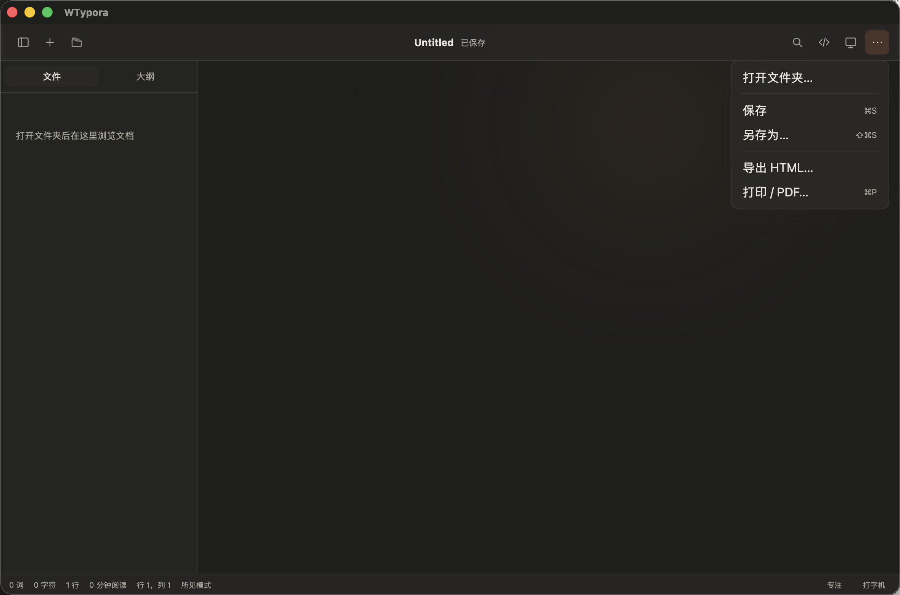
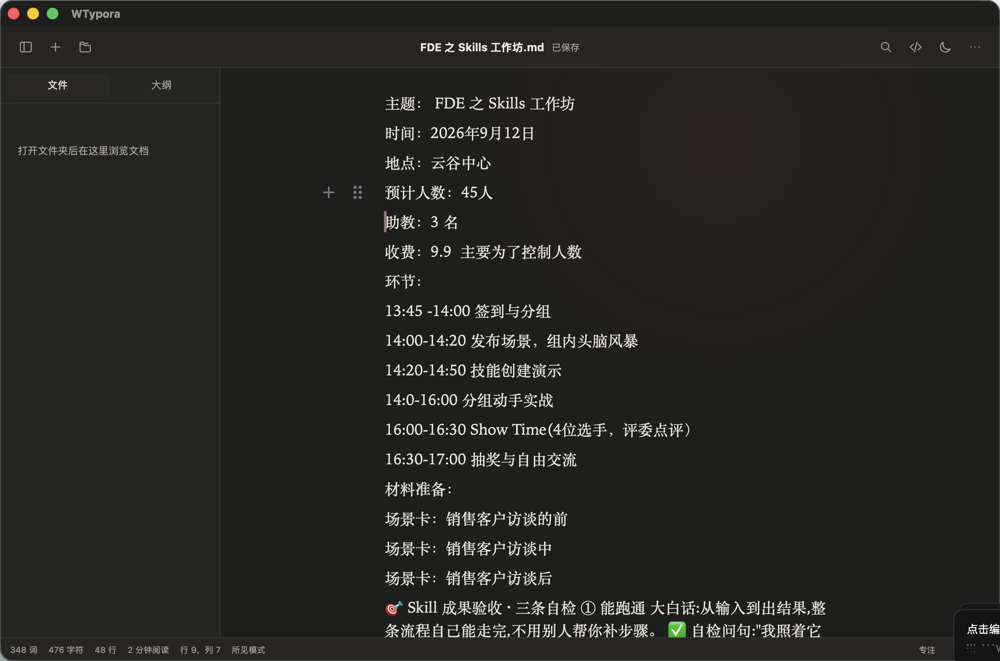

# macOS“打开方式”无法打开文档修复报告

- 日期：2026-09-04
- 修复范围：macOS 文件关联、桌面打开事件、前端文档接收与编辑器初始化
- 处理状态：已修复
- 发布状态：修复提交 `076ff6431d3e9207cc657730161eb842f2c7cd46` 已推送至 `origin/main`；本机 `/Applications/WTypora.app` 已安装并验证

## 问题与影响

- 实际行为：在 Finder 中右键 Markdown 文件，选择“打开方式 → WTypora”后，系统提示无法确定应用是否可以打开该文档；即使继续，WTypora 也只显示空白的 `Untitled`。
- 期望行为：无论 WTypora 是否已启动，选择 WTypora 后都应聚焦应用并打开指定的 `.md`、`.markdown` 或 `.txt` 文件。
- 复现条件：macOS；通过 Finder“打开方式”或 `open -a /Applications/WTypora.app <文件>` 启动。
- 影响范围：所有从系统入口交给 WTypora 的受支持文本文件；应用内“打开文件”不属于此次故障入口。

## 根因

问题发生在系统文件入口到前端文档状态之间的调用链：

1. 应用包未声明 `CFBundleDocumentTypes`，Finder 无法确认 WTypora 支持 Markdown/纯文本文件。
2. Tauri 运行循环未处理 macOS 的 `RunEvent::Opened`，系统交付的文件 URL 被忽略。
3. 系统入口得到的路径未加入后端访问授权，前端即使收到路径也无法可靠读取。
4. 冷启动时原生事件可能早于前端监听器，缺少待打开文件队列会丢失首次请求。

真实集成验证还发现一个数据完整性风险：Crepe/Milkdown 挂载期间会异步发出“规范化后的 Markdown”更新；旧逻辑把它当作用户编辑并触发自动保存，可能改变列表符号、表格空格等源码格式。失败样本通过逐字节 `cmp` 稳定复现，修复后冷启动和热启动均保持内容与修改时间不变。

## 处理与修复点

1. 为 `.md`、`.markdown`、`.txt` 增加 macOS 文档类型声明，角色为 Editor。
2. 在 Tauri 运行循环中接收 `RunEvent::Opened`，过滤受支持文件，授予访问权限，聚焦窗口并通知前端。
3. 增加一次性待打开文件队列；前端先订阅实时事件、再排空队列，兼容冷启动和应用已运行两种时序。
4. 前端按顺序打开系统交付的最后一个有效文件，并把错误交给现有错误提示链路。
5. 编辑器只有在检测到真实用户交互后才接受视觉编辑器产生的 Markdown 更新；程序化查找替换显式授权，避免初始化规范化触发自动保存。
6. 增加 Rust 队列/授权测试和 React 桌面打开请求回归测试。

## 变更范围

- `src-tauri/tauri.conf.json`：声明 Markdown 与纯文本文件关联。
- `src-tauri/src/lib.rs`：处理 macOS 打开事件、发出前端事件并聚焦主窗口。
- `src-tauri/src/state.rs`：新增受支持文件过滤与待打开文件队列。
- `src-tauri/src/commands/mod.rs`：暴露一次性排空队列的命令。
- `src-tauri/tests/open_files.rs`：覆盖过滤、授权和只排空一次的后端回归测试。
- `src/native/types.ts`、`src/native/nativeBridge.ts`、`src/native/browserBridge.ts`：增加系统打开文件监听桥接。
- `src/app/App.tsx`、`src/app/App.test.tsx`：接收桌面请求并打开文档，覆盖用户可观察行为。
- `src/editor/VisualEditor.tsx`：阻止初始化规范化被误判为用户编辑。

## 修复前后对照

### 对照 1：从 macOS 系统入口打开 Markdown

环境：本机 macOS；窗口 1180 × 780 点，截图 2360 × 1560 像素；深色主题；测试路径为用户提供的工作坊 Markdown。前后截图使用同一路径；文档正文在两次截图之间由用户继续编辑，因此本组只对照“系统请求是否成功打开指定文件”，不用于比较正文内容。

修复前：

修复后：

可观察差异：修复前窗口停留在空白 `Untitled`；修复后标题显示 `FDE 之 Skills 工作坊.md`、状态显示“已保存”，并呈现目标文档。打开后等待 5 秒，文件 SHA-256 和修改时间均未变化。

## 自动验证

| 检查 | 命令或方式 | 结果 |
|---|---|---|
| 后端缺陷回归 | `cargo test` | 通过：17 项集成测试，其中系统打开队列 1 项 |
| 前端完整测试 | `npm test -- --run` | 通过：17 个测试文件、83 项测试 |
| 类型与静态检查 | `npm run typecheck && npm run lint` | 通过 |
| Rust 格式检查 | `cargo fmt -- --check` | 通过 |
| 生产构建 | `npm run tauri build -- --bundles app` | 通过；生成 ad-hoc 签名的 macOS `.app` |
| 包声明与签名 | `PlistBuddy` 检查 `CFBundleDocumentTypes`；`codesign --verify --deep --strict` | 通过 |
| 冷启动真实交互 | 退出应用后执行 `open -a /Applications/WTypora.app <样本>`，等待 5 秒并 `cmp` | 通过；文件与 mtime 均不变 |
| 热启动真实交互 | 保持同一 PID，再次 `open -a` 打开另一文件，等待 5 秒并 `cmp` | 通过；同一进程成功切换且文件不变 |
| 用户文档验收 | 备份当前文档，冷启动打开，等待 5 秒后比对 SHA-256、mtime 与备份 | 通过；SHA-256 为 `72ee7f79b1daf1ab57005b6b1d42ef99808cebd20ad9d593c20dc7cdedd70b46`，mtime 未变化 |
| 本机安装产物 | `/Applications/WTypora.app` 可执行文件摘要与签名校验 | 通过；SHA-256 为 `8360710619157e64020300f0c4c340875788b4917416d015ad9ba7a79841ba7d` |

完整自动检查在只包含本次暂存改动的隔离快照中执行，避免把工作区现有的 `src/styles/app.css` 用户改动带入结果或安装包。

## 已知限制

- 真实系统交互仅在 macOS 上验证；Windows/Linux 的系统文件打开入口未做实机验证。
- 本机产物为 Tauri 默认 ad-hoc 签名，未做 Apple notarization，适合当前本机安装验证，不代表公开分发签名。
- 修复前的应用版本和中间验证版本均保留在废纸篓，可恢复；用户文档最终验证前的副本保留为 `~/.Trash/FDE-Skills-工作坊-before-final-open-20260904.md`。
