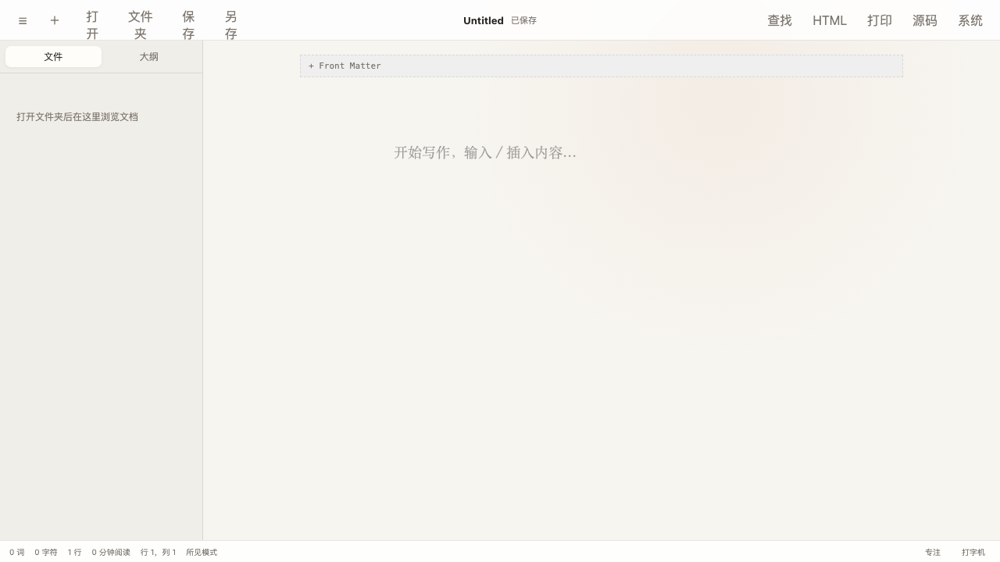
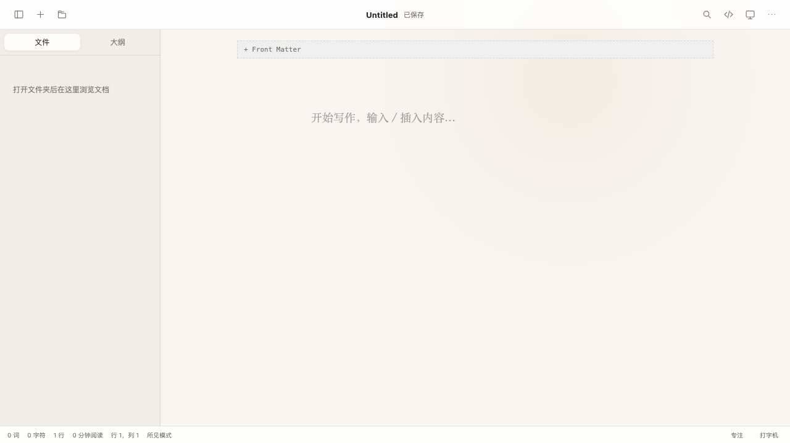

# 顶部工具栏与窗口关闭修复报告

- 日期：2026-09-04
- 修复范围：顶部工具栏、更多操作菜单、macOS 主窗口关闭权限
- 处理状态：已修复
- 发布状态：已随修复提交到本地 `main`；上游 `origin/main` 已失效，因此未推送；release 已安装到本机 `/Applications/WTypora.app` 并启动。

## 问题与影响

- 实际行为：顶部同时展示 11 个文字按钮，在 1280×720 视口下中文标签被挤成竖排；左上角原生关闭按钮进入未保存确认后无法真正关闭窗口。
- 期望行为：顶部操作简洁、稳定、不换行；关闭按钮在干净文档时直接关闭，在未保存文档确认放弃后关闭。
- 复现条件：macOS 桌面窗口；工具栏问题在 1280×720 可稳定观察；关闭问题在文档 dirty 状态点击左上角关闭并确认放弃时出现。
- 影响范围：主窗口工具栏可用性，以及 macOS 原生交通灯关闭操作。

## 根因

工具栏将常用与低频动作全部作为带中文文字的内联按钮渲染，左右区域最小宽度不足时文本允许换行，因此多个二字标签竖向堆叠。

关闭链路存在两条 Tauri 窗口 API：应用菜单退出在 `src/app/App.tsx:157` 调用 `close()`；dirty 文档的原生关闭事件在 `src/app/App.tsx:228-233` 先拦截，再经未保存确认调用 `destroy()`。原 capability 只有 `core:default`，没有显式允许 `core:window:allow-close` 与 `core:window:allow-destroy`，导致前端调用被 Tauri ACL 拒绝。能力契约测试在修复前失败，补齐两项权限后通过。

## 处理与修复点

1. 顶部改成左右图标工具栏，中间只保留文件名和保存状态；高频操作保持一键可达。
2. 将打开文件夹、保存、另存、导出 HTML、打印/PDF 收入“更多操作”菜单，并支持点击外部与 Escape 关闭。
3. 为按钮补齐 `aria-label`、`title`、菜单角色及展开状态，不用图标牺牲可访问名称。
4. 主窗口 capability 增加 `allow-close` 与 `allow-destroy`，同时增加独立回归测试，防止权限再次遗漏。

## 变更范围

- `src/components/TitleBar.tsx`：重构为图标工具栏和更多操作菜单。
- `src/styles/app.css`：收紧顶部高度、间距、图标按钮与弹出菜单样式。
- `src/components/TitleBar.test.tsx`：新增菜单和高频操作回归测试。
- `src/app/App.test.tsx`：让既有工作区、导出测试覆盖新的菜单入口。
- `src/app/tauriCapabilities.test.ts`：新增 close/destroy 权限契约测试。
- `src-tauri/capabilities/default.json`：允许主窗口 close/destroy。
- `src-tauri/gen/schemas/capabilities.json`：由 Tauri 构建同步生成的 capability schema。

## 修复前后对照

### 对照 1：空白文档顶部工具栏

环境：本地开发环境；视口：1280×720；主题：浅色；测试数据：空白 `Untitled` 文档。修复前截图来自基线提交 `436b081` 的隔离 worktree，修复后截图来自当前工作区。

修复前：

修复后：

可观察差异：顶部文字按钮及竖排标签已消失，左右只保留统一尺寸的图标按钮，中间文件名和保存状态不变；低频动作仍可从右侧“更多操作”菜单进入。

## 自动验证

| 检查 | 命令或方式 | 结果 |
|---|---|---|
| 缺陷回归测试 | `npm test -- --run src/components/TitleBar.test.tsx src/app/tauriCapabilities.test.ts` | 通过：2 个文件、4 项测试 |
| 前端全量测试 | `npm test -- --run` | 通过：16 个文件、72 项测试 |
| Rust 全量测试 | `cargo test --manifest-path src-tauri/Cargo.toml --locked` | 通过：16 项测试 |
| lint / 类型 / 构建 | `npm run lint`、`npm run typecheck`、`npm run build` | 全部通过 |
| Rust 静态检查 | `cargo fmt --manifest-path src-tauri/Cargo.toml -- --check`、`cargo clippy --manifest-path src-tauri/Cargo.toml --locked --all-targets -- -D warnings` | 全部通过 |
| 依赖检查 | `npm audit --omit=dev --audit-level=high --offline` | 通过：0 vulnerabilities |
| 桌面打包 | `npm run tauri -- build --debug` | 通过：生成 arm64 `.app` 与 `.dmg` |
| Release 打包 | `npm run tauri build` | 通过：生成并临时签名 release `.app` 与 arm64 `.dmg` |
| 签名校验 | `codesign --verify --deep --strict src-tauri/target/debug/bundle/macos/WTypora.app` | 通过 |
| 界面交互验证 | 1280×720 前后截图；打开“更多操作”并检查 5 个菜单项 | 通过 |
| 安装版退出验证 | 启动 `/Applications/WTypora.app`，按精确 PID 发送 `Cmd+Q` | 通过：进程正常退出，没有 ACL 错误；随后重新启动成功 |

## 本机安装与运行验证

- 源码提交：`0f60917430c8f01540b4249f2ed617bc0c12fa8c`。
- 安装版本：`0.1.0`。
- Release 可执行文件 SHA-256：`e14cd3c741bba28d7809a0cb9bd1f52d1b3e97a4705613f70ed14169be39e0ea`。
- DMG SHA-256：`26fff5c3bb4321a0955cb3848527940eb12f8ed97f828a4a73e70b3a34411751`。
- 安装前旧版可执行文件 SHA-256：`76b9a9e8e6ee5b92a8d907dea0788dba048787d7182a3cd8a26cbee8ff40a681`。
- 旧版备份：`/Users/wuming/.Trash/WTypora-before-acl-fix-20260904-1225.app`，可从废纸篓恢复。
- 安装校验：安装版签名有效，安装后可执行文件哈希与 release 产物一致。
- 运行验证：首次启动 PID `62747`，实际 `Cmd+Q` 后正常退出；再次启动 PID `62812`，启动 3 秒后仍正常运行。
- 自动重装验证：后续重装时未发现残留运行进程；同一已校验 release 经临时安装位复制、签名与哈希复核后替换成功，替换前版本备份至 `/Users/wuming/.Trash/WTypora-reinstalled-20260904-1230.app`，最终启动 PID `71750`。

## 已知限制

- 当前自动化环境没有录制 macOS 原生交通灯按钮的 dirty 文档确认流程；该 `destroy` 路径由 capability 契约测试覆盖。安装版应用菜单 `Cmd+Q` 的 `close` 路径已实际运行验证。
- Vite 仍提示主 `index` chunk 约 2148.75 kB，属于现有首屏性能技术债，不影响本次功能正确性。
- 当前 `origin/main` 跟踪分支已失效且远端没有可用 heads，因此本次未推送；本机安装已经完成。
