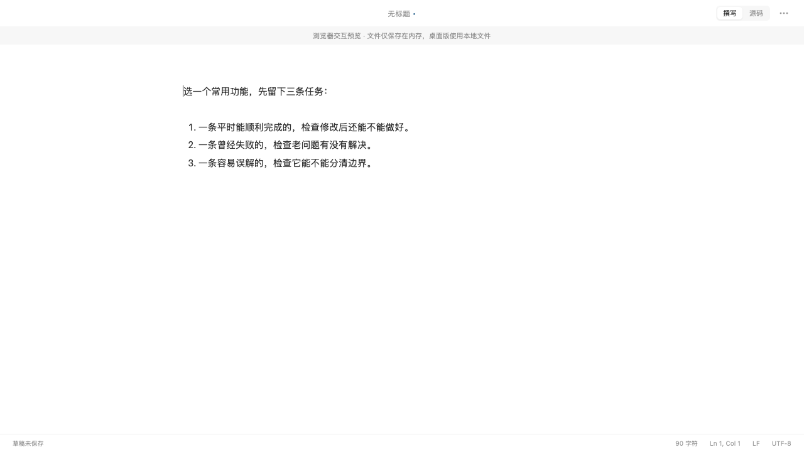
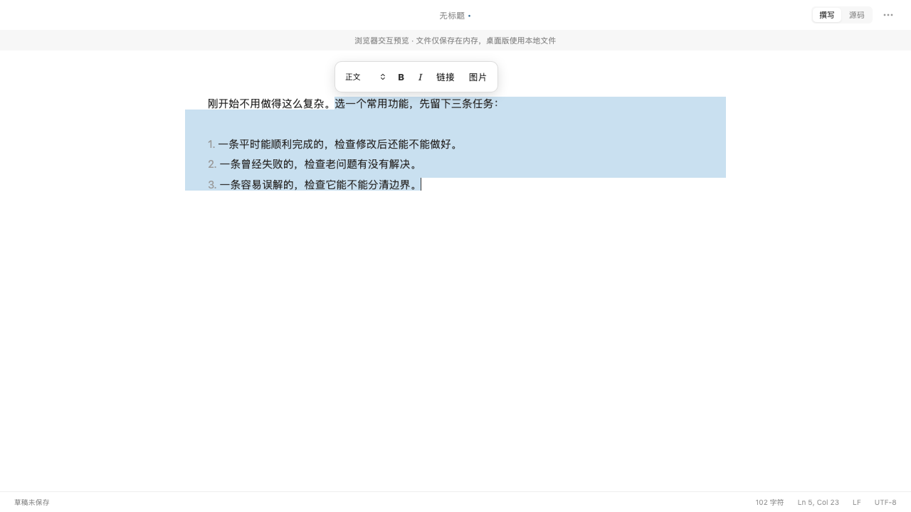
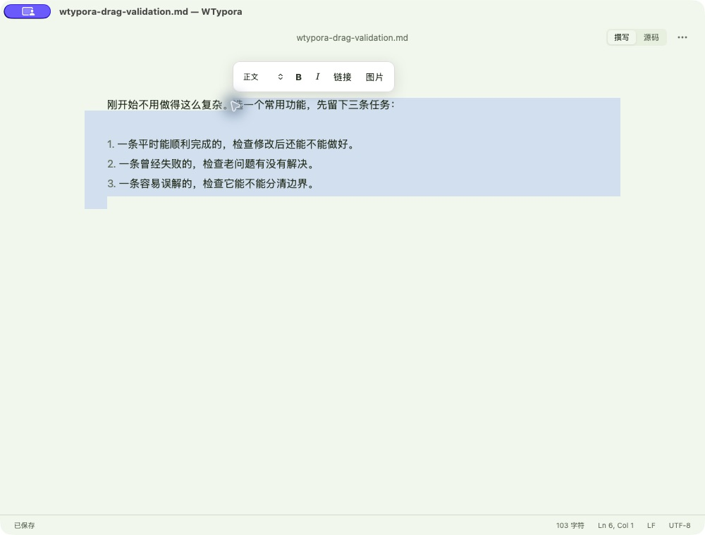

# 正向拖选失效修复测试报告

## 一、基本信息与结论

- BUG-01：撰写模式从已排版段落向后拖选编号列表时，选区为空；反向可用。
- 版本：`12e10bd`，任务开始时工作区干净。修改位于 `liveMarkdown.tsx`，新增 `drag-selection.spec.ts`。
- 日期：2026-10-06，Asia/Shanghai。macOS 26.6.2 arm64，Node 26.8.1、Rust 1.98.1，CodeMirror 6.43.11，Playwright 1.63.0，Chromium / WebKit。
- 当前结论：源码修复、自动化回归、稳定签名构建与本机安装启动通过。原生点击定位及键盘扩选通过；原生真实鼠标拖选和最小窗口验收待人工确认，因此不宣称完整交付门禁通过。
- 隐私：使用独立合成样例；未把原文章、私人路径或签名账户写入报告或测试文件。

## 二、验收标准对照

| 编号 | 标准 | 当前结果 |
| --- | --- | --- |
| BUG-01 | 段落到列表正向拖选，选区完整且起点准确 | 浏览器通过 |
| BUG-01-R1 | 反向拖选、上下文光标在首尾、普通段落及单段落 | 浏览器通过 |
| BUG-01-R2 | Shift 扩选、格式菜单、图片点击及 Markdown 原文保持 | 浏览器通过 |
| DELIVERY | 本机稳定签名、安装、启动及原生交互 | 签名、安装启动、点击定位和键盘扩选通过；真实拖选及最小窗口待人工确认 |

## 三、自动化测试结果

所有命令在项目根目录运行，以下成功命令退出码均为 0。

| 测试 | 命令 | 实际结果 |
| --- | --- | --- |
| 修复前反馈循环 | `npm run e2e -- drag-selection.spec.ts --project=webkit` | 1 失败、1 通过；正向预期完整文本，实际空字符串；反向通过，退出码 1 |
| 最小化复现 | `WTYPORA_DRAG_MINIMAL=1 npm run e2e -- drag-selection.spec.ts --project=webkit`（当时的复现脚本） | 缩成两个普通段落仍 1 失败、1 通过；不依赖列表及文章内容 |
| 新增回归 | `npm run e2e -- drag-selection.spec.ts --workers=2` | 26 通过，11.0 秒；包含单段落控制组 |
| 完整质量门禁 | `npm run check` | 122 前端测试通过；49 Rust 测试通过、3 忽略；格式、类型、lint、构建、Rust fmt、Clippy 通过 |
| 完整 E2E | `npm run e2e -- --workers=2` | 72 通过，2 跳过，29.6 秒；包含上述 26 项，不重复计数 |
| macOS 构建 | `npm run tauri -w @wtypora/desktop -- build --debug --bundles app` | 构建成功，arm64 本机开发签名；按现有策略未公证 |

Rust 忽略 3 项：两个子进程入口（由父测试调用）及本机 PicGo-Core 手工检查；E2E 跳过 2 项为可选性能采样。详见保留日志。调试阶段曾出现测试读取选区接口错误，改用 `EditorView.findFromDOM` 后才计入复现证据。初版修复还出现起点偏移和图片点击回归，均在最终实现中修正，完整套件再次通过。

## 四、改动说明与前后证据

### BUG-01

复现：加载一个段落和三条编号列表，将光标放在列表末尾，从段落向列表末尾按住鼠标拖动。1280×720 浏览器预览，普通使用者，无外部服务。

排名假设：① 已排版块截断鼠标手势；② 格式浮层拦截；③ 重排导致坐标失效。实际验证①成立：旧 `mousedown` 调用 `preventDefault()` 并移动光标，widget 的 `ignoreEvent()` 同时屏蔽编辑器事件，使 CodeMirror 没有开始跟踪后续鼠标移动。从活动块起选不经过这条路径，因此方向差异实际由起点状态决定。保留浮层，仅修复事件路径即可通过，排除②。③在初版修复中表现为图片收缩后点击落到其他块，最终用块内坐标限制解决。

修复：widget 将鼠标按下交给编辑器，`mouseSelectionStyle` 先展开块，再在源码中解析并保存起点，拖动、自动滚动、鼠标释放由 CodeMirror 管理；映射文档修改后的锚点，保留 Shift/多选语义，图片点击仍定位其源码开头。

图 1：修复前 WebKit 的正向拖选，未产生选区。使用合成数据，未复制原文章。

图 2：WebKit 正向拖选通过，原文和选区断言均通过。与图 1 同为 1280×720；为补查段落中间起选，增加了一句前缀，选区从前缀之后开始。

图 3：已安装新版的完整 1000×760 原生窗口，现有浅色主题、默认缩放；点击段落中间后用 Cmd+Shift+End 扩选，原生辅助功能明确读出正确选区，格式浮层可见。这是键盘扩选证据，不能当作鼠标拖选通过证据。已实际查看窗口四边、标题、正文、状态栏及浮层，未见裁切、遮挡或圆角异色色块。样例完全容纳于窗口，无需滚动；最小 580×420 原生窗口因同一拖拽限制未验收，屏幕可用区域未单独测量。

### 本机交付记录

- 构建产物：`target/debug/bundle/macos/WTypora.app`，arm64 debug，与项目既有本机交付方式一致。
- 安装位置：`/Applications/WTypora.app`；旧包另存本机缓存备份，未清理工作区、草稿、配置或授权。
- 旧 PID 1758 通过 Cmd+Q 正常退出，无残留；未强制终止。退出前文档显示已保存，启动后恢复草稿入口选择“稍后处理”，保留所有恢复记录。
- 签名：复用现有 Apple Development 身份；新包满足旧包 designated requirement，签名完整性通过，entitlements 不变。首次验证命令缺少 `-R` 表达式的 `=` 前缀导致命令错误，修正语法后检查通过；不是身份迁移。安装后再次验证完整性，安装和构建主程序 SHA-256 相同：`ee29e0f2ed452f6065bdd2e88432b6942fa48f3616033ef0de031c4427aa6090`。
- 新 PID 9938，真实执行路径来自上述安装包，持续运行；原生打开本地测试文件成功，未出现新增授权提示。未实测的其他受保护目录权限不作保留承诺。
- 原生拖拽工具尝试：撰写跨块、源码跨行、源码单行，均只定位起点、不产生选区；源码对照不经过本次修复路径，故记录工具限制，不能将此项记为通过。已请用户用真实鼠标验证。
- 未改变窗口布局、主题或导出协议。用户随后明确要求推送代码；本次修复、回归测试及脱敏报告一起提交至 `main`，推送目标为 `origin/main`。

日志：[质量门禁](assets/evidence/20261006-212446-forward-drag-selection-测试报告/check.log)、[完整 E2E](assets/evidence/20261006-212446-forward-drag-selection-测试报告/e2e.log)、[构建](assets/evidence/20261006-212446-forward-drag-selection-测试报告/build.log)。

## 五、代码审查与优化

自查发现：仅放行鼠标事件会把段落中间的起点吸附到块边界；先展开块后使用普通坐标又会使大图片点击落到后文。最终使用鼠标选择扩展保存准确起点，并限制到被点击块范围，图片保持原有入口。相关回归全部通过。未委派独立审查。

## 六、遗留事项与验收建议

- 待人工确认：原生真实鼠标拖选、最小窗口适配；原因是原生拖拽自动化在源码对照中也不能形成选区。修复后的浏览器鼠标回归已通过，不能冒充完整原生验收。
- 图片链接已检查、PNG 已解码并实际查看；已请求在 Codex 打开报告（返回 queued），Markdown 预览渲染尚未验证。
- 代码推送已获用户授权；不涉及 release 发布或公证。原生待人工确认项不因代码推送而改记为通过。
- 复查：打开 Markdown，在撰写模式把光标放到列表末尾，从上一段中间向下拖选，再反向拖选，确认范围准确。
