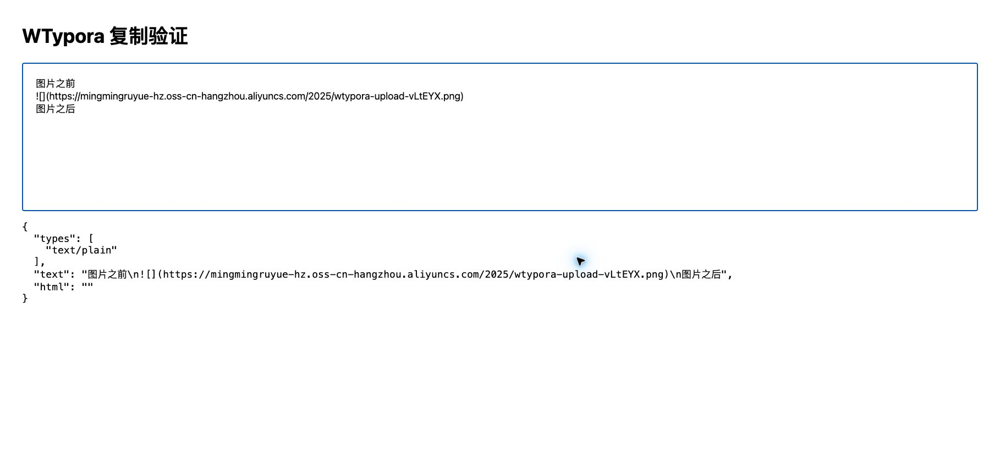
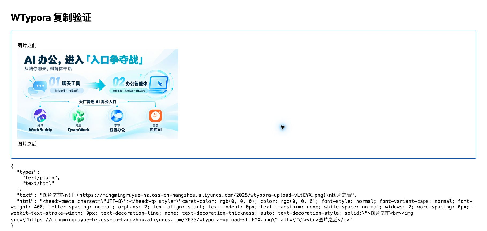

# Markdown 复制到文档编辑器丢图片修复

- 日期：2026-09-10
- 状态：复制链路已修复，已安装并验证；飞书端新版粘贴待用户实测。
- Git：未提交、未推送。工作区存在大量先前改动，本次保留原状；没有外部推送授权。

## 原因与修复

安装版源码模式中选中“图片之前 / Markdown 图片 / 图片之后”，通过系统 Cmd+C、Cmd+V 粘贴到本地浏览器富文本接收页。旧版实际只有 `text/plain`，没有 `text/html`，接收页显示图片语法而不是图片。飞书中只剩感叹号的具体解析过程未直接复现，但软件缺少富文本输出已通过原生剪贴板接收证实。

新增 `src/editor/clipboard.tsx`，并在 `buffer.ts` 中注册复制处理器。普通复制同时提供选区 Markdown 原文与安全渲染的 HTML，HTTP(S) 图片输出为 img，保留 GIF 地址及图文顺序、换行、列表、强调等。原始 HTML 不执行，不支持的图片保留文字说明。CodeMirror 粘贴仍使用纯文本，不改变文档保存格式；剪切和无选区复制继续使用原有行为。

仅新增复制模块、四项回归测试、两行缓冲区接入，以及独立端口测试配置和本报告/截图。没有调整此前功能代码。

## 修复前后

相同 macOS 安装路径、同一 Chrome 本地富文本接收页、相同测试文本和图片、相同视口（1818 × 862）。图片为用户文章中的现有图床图片；截图及报告未推送。

旧版：只有纯文本，图片位置显示 Markdown 图片语法。

新版：接收到 text/plain 和 text/html，图片正常加载（naturalWidth=1672），文字分别位于图片上下方。Markdown 原文仍完整保留在纯文本格式中。

## 验证

| 检查 | 结果 |
| --- | --- |
| 回归测试 | 接入修复前 3 项失败；接入后 4 项全部通过。覆盖源码/撰写复制、图文顺序、GIF 地址、仅复制选区、CRLF、代码及不安全图片 |
| npm run check | 通过：格式、类型、lint、112 个前端测试、前端构建、Rust fmt/test/clippy；Rust 42 通过、3 项原有忽略 |
| 浏览器 E2E | 46 通过、2 项原有可选性能测试跳过。默认 1420 端口被另一项目占用，首次运行无效；改用 playwright.clipboard.config.ts 的 1422 独立端口完整重跑通过 |
| macOS 打包 | tauri build --debug --bundles app 成功，开发证书签名；未做公证，沿用既有本机交付方式 |
| 包校验 | 构建包及 /Applications/WTypora.app 均通过 verify-macos-bundle.mjs |
| 安装 | 旧应用包备份于 target/clipboard-check/backup；安装包与构建产物主程序 SHA-256 相同：549360087c3b001adf4618b6be122894e4b3291f7172a571dc384439617a0eeb |
| 启动与功能 | 从 /Applications/WTypora.app 启动，新版实际系统复制/浏览器粘贴通过；进程持续运行 |
| 外部文档 | 未再次修改用户飞书文章；新版飞书端实际粘贴尚未复测 |

构建有既有分块尺寸警告；不影响构建成功。详细本地日志位于 target/clipboard-check/。

## 使用及边界

选择内容后使用 Cmd+C、普通 Cmd+V。若目标选择“仅粘贴文本”，则仍会得到 Markdown。图片采用原 HTTP(S) 地址，不会新上传到第三方；目标平台仍需要能访问该地址。本地/相对路径图片沿用现有不支持边界。
