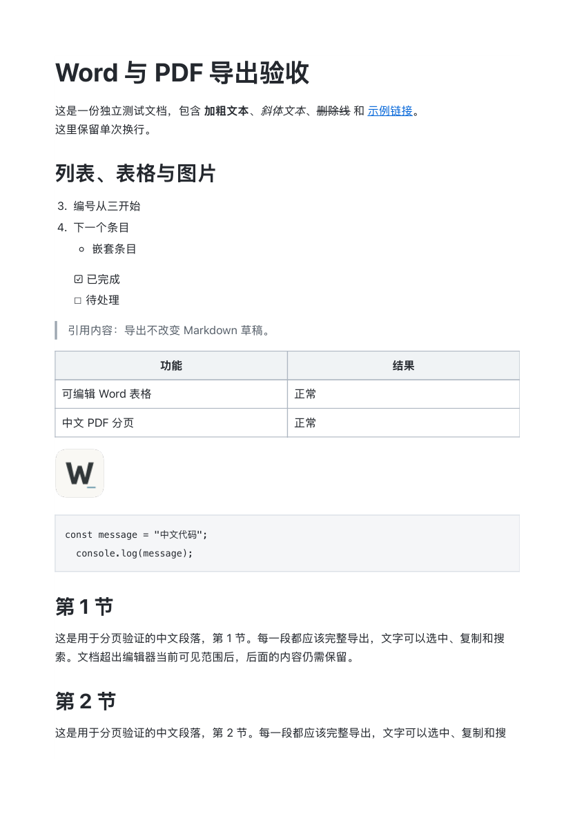

# Word / PDF 导出与 PDF 卡顿修复验收

- 日期：2026-09-09
- 状态：功能已实现，PDF 主线程卡顿已修复，已安装并验证 `/Applications/WTypora.app`。
- Git：未提交、未推送。保留进入任务前已有的大量工作区修改；未发布到外部平台。

## 行为

「文件」与右上角「文档操作」菜单支持 Word（.docx）和 PDF。导出完整的当前编辑快照，包括未命名、未保存内容，不改变原文路径、保存状态或撤销记录。支持中文、标题、强调、引用、列表、任务列表、表格、链接、代码及 HTTP(S) 图片。Word 使用标准可编辑 OOXML；macOS PDF 使用系统 A4 分页和白底样式。原生保存面板负责覆盖确认，临时文件校验成功后才原子替换目标。

图片最多每张 10 MB、累计 40 MB，支持 PNG、JPEG、GIF、WebP、BMP。导出不执行原始 HTML；本地、无效或加载失败的图片保留占位说明并在完成提示中报告数量。PDF 目前支持 macOS 11+；其他平台未实机验证。

## PDF 卡顿根因与修复

第一版在 Tauri 主线程调用 `NSPrintOperation::runOperation()`。WebKit 尚未计算出页数时返回临时范围 `NSIntegerMax`，该路径将其当成实际页数持续打印，用户出现彩色等待光标。运行采样确认主线程持续处于打印渲染函数，CPU 接近 100%，临时文件增长超过 1 GB。

修复使用 `setCanSpawnSeparateThread(true)` 与窗口异步打印接口，在后台等待真实页数和生成 PDF；完成回调后才校验并保存文件。使用独立打印设置、跨窗口互斥和正确的回调生命周期，不修改全局打印偏好。详见 [原生卡顿证据](evidence/export/pdf-hang-evidence.md)。此项仅调整原生调度，没有界面内容/布局变化；使用采样证据验证故障，未伪造修复前截图。

## 实际验证

| 检查 | 状态与证据 |
| --- | --- |
| 完整自动检查 | 通过：`npm run check`；102 项前端测试，41 项 Rust 测试，3 项既有手工/子进程测试忽略；格式、类型、lint、构建、Clippy 均通过。见 [检查日志](evidence/export/check.log) |
| 浏览器行为 | 通过：Chromium/WebKit 共 4 项导出 E2E，覆盖可编辑 Word、嵌入图片、长文完整导出、白底打印、隐藏应用控件和最小窗口菜单。见 [E2E 日志](evidence/export/e2e.log) |
| 打包与签名 | 通过：本次 debug app bundle 已按项目证书签名；构建和安装包 `verify-macos-bundle.mjs` 校验通过。未作发行公证，沿用项目本地开发包交付方式 |
| 安装与运行 | 通过：`/Applications/WTypora.app`；安装与构建可执行文件 SHA-256 一致，安装版进程持续运行。SHA-256：`2eb194cc8c33f0ee91b6ccd0c7f5b5058da0b3f0d3e7ddfcaeede1c8a6f697de` |
| 原生 PDF | 通过：在安装版点选导出和系统保存按钮，约 1.131 秒后观察到「已导出」且窗口恢复可操作；生成 4 页 A4、76,149 字节、1 张嵌入图片，20 节和文末标记全部保留。已查看首页和末页、核对全部页文字；中文文本可提取（macOS 字形映射的兼容字符按 NFKC 归一化核对）。见 [PDF](evidence/export/native.pdf) |
| 原生 Word | 通过：在安装版操作保存，生成 12,430 字节文件；python-docx/ZIP 校验真实 Heading 1、表格、图片、超链接、从 3 开始的编号和文末标记。WPS 成功打开并实际查看标题和正文排版。见 [Word](evidence/export/native.docx) |
| 界面验收 | 通过：实际查看安装版文档菜单，两个入口无截断；点击两种导出入口，系统面板正常显示，完成后提示文件名，原编辑内容保持。小窗口菜单滚动由双浏览器 E2E 验证 |
| 异常路径 | 通过：取消及失败清理打印节点并恢复编辑；源 Markdown 扩展名不能被导出覆盖，错误/空输出保留目标文件，符号链接被拒绝；对应前端/Rust 行为测试通过 |
| 条件联动 | 通过：两套菜单、窗口定向命令、NativeBridge/FakeBridge、README 同步；未改数据格式或迁移用户数据 |
| Git / 未完成事项 | 无外部推送授权，未提交或推送；本次 macOS 功能交付无剩余必需步骤 |

原生文件结构检查数据见 [native-results.json](evidence/export/native-results.json)。

卡顿时留下的未完成临时 PDF 已移入本地缓存保留，不留在 Markdown 所在目录，未删除其内容。测试图片服务已停止。
