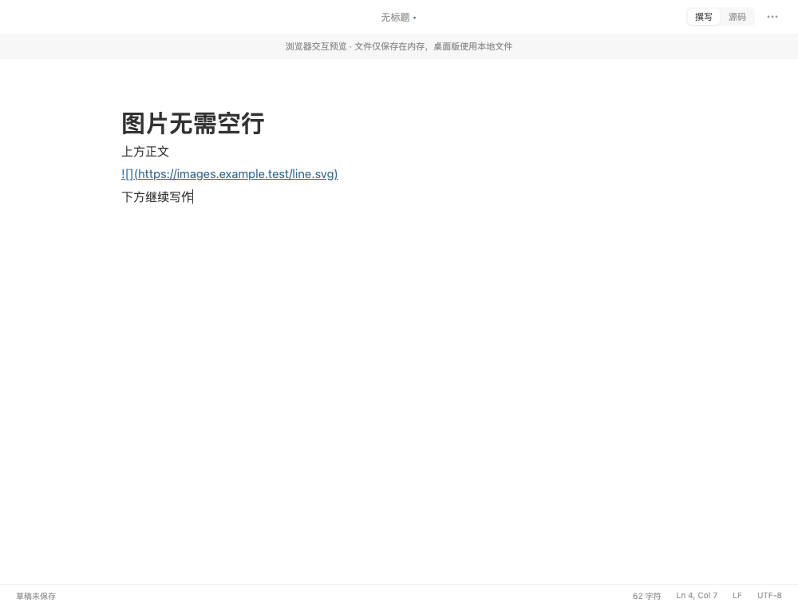
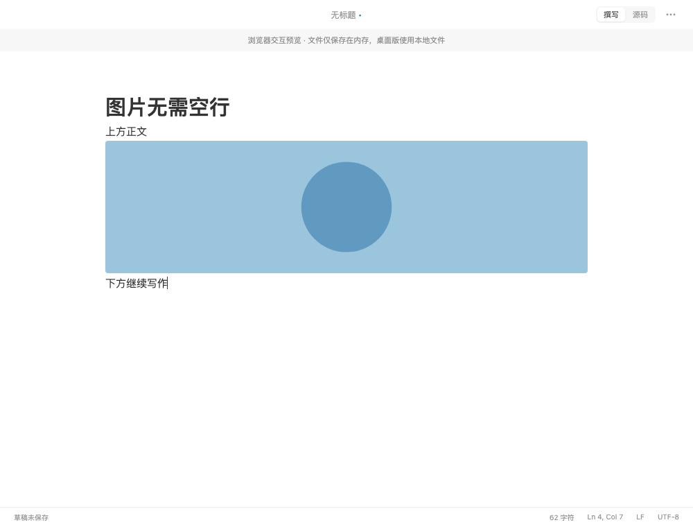

# 图片不应依赖空行才能预览

日期：2026-09-07。状态：已修复，已签名打包、安装及原生验收；未提交、未推送。

## 问题与根因

最小复现：正文、独占一行的 Markdown 图片、后续正文连续三行，不加空行，光标停在后续正文。原版没有生成图片元素，新增浏览器回归测试在图片可见性断言失败。

Markdown 将这些行解析成同一个 Paragraph。撰写模式按照整个语法块决定是否显示源码，光标在相邻文字中会使图片也一直显示源码。

## 修改

- `apps/desktop/src/editor/liveMarkdown.tsx`：仅在顶层段落中，将语法树确认的独占一行图片拆成独立编辑范围。前后正文保持各自范围，点击图片显示源码，离开图片行后恢复预览。
- 不增加空行，不改动文档内容。支持连续图片、图片说明和标题、引用式图片、行首尾空白。
- 行内图片、转义内容、行内代码、代码块、引用块及列表保留原有语义。
- `apps/desktop/src/editor/liveMarkdown.test.ts` 和 `apps/desktop/e2e/image-lines.spec.ts`：增加对应回归保护，验证图片加载、点击编辑、移动至相邻文字、源码行数和内容保持不变。

## 前后对照

同一合成文档、Chromium、1000 × 760、浅色主题；图片由测试拦截请求返回。图片上下均无空行，光标均在下方正文末尾。

修复前：显示图片源码，未出现图片元素。

修复后：图片正常显示，下方正文可以继续编辑。

## 交付检查

| 检查 | 结果与证据 |
| --- | --- |
| 原问题复现 | 原版浏览器测试失败，见 `evidence/image-no-blank-line/before.log` |
| 全套检查 | `npm run check` 通过：格式、类型、lint、88 项前端测试、前端构建、Rust 38 项通过 / 3 项既有忽略、Clippy；见 `check.log` |
| 交互测试 | `npm run e2e`：Chromium、WebKit 共 34 项通过，2 项可选性能采样跳过；见 `e2e.log` |
| 构建 | `npm run tauri -w @wtypora/desktop -- build --debug` 成功，Apple Development 签名；见 `bundle.log`。未做发行公证 |
| 包校验与安装 | 构建包、安装包均通过 `verify-macos-bundle.mjs`。完整替换 `/Applications/WTypora.app`，旧包保留于本地临时备份，二进制 SHA-256 一致；见 `installation.json` |
| 启动与界面 | 从固定安装路径启动；实际查看本地合成文档的图片显示，点击图片进入第 3 行源码，移到第 4 行恢复图片。原文 57 字符、4 行且已保存。已重新打开此前用户文章，保持新版运行 |
| 条件联动 | 不涉及 IPC、权限或数据结构变更 |
| Git | 工作区原有大量未提交及未跟踪改动，本次保留现场；未提交、未推送 |
| 未完成事项 | 无本地交付阻塞；外部发布不在本次授权范围 |

测试过程中修正了两项测试操作假设：向上键按视觉块导航不能保证落在图片源码；CodeMirror 各行 DOM 的 textContent 不包含换行，故按 `.cm-line` 校验完整行数组。最终完整交互套件已通过。

## 边界

本次解决顶层独占一行 Markdown 图片的编辑范围。光标直接位于图片行时，仍显示链接源码以便编辑。列表或引用块内的图片沿用整个块的编辑行为；本地及相对图片路径支持不在本次范围。
