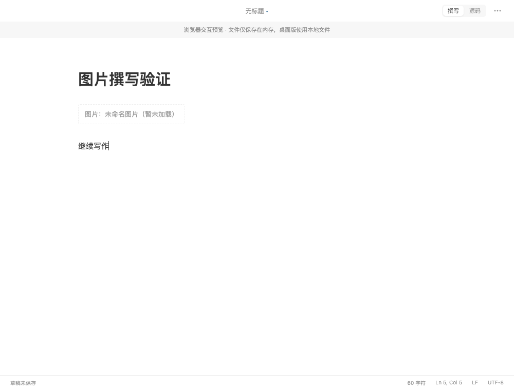
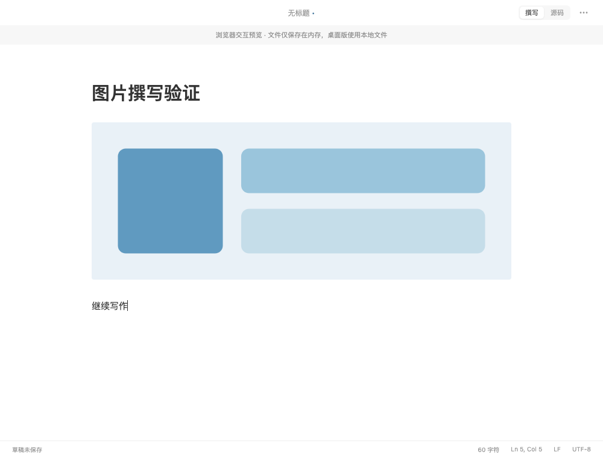
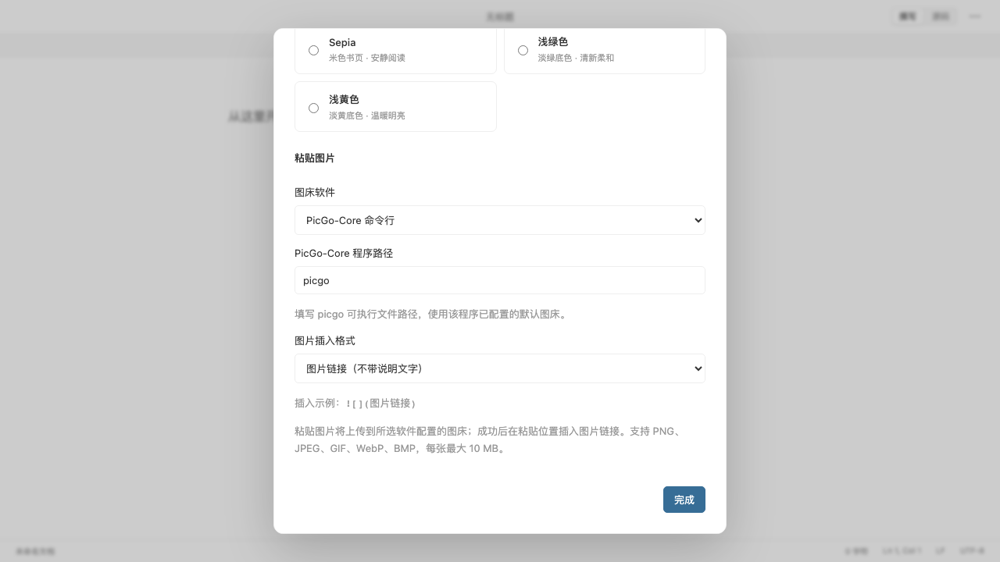

# 图片插入格式与撰写图片显示

日期：2026-09-06。状态：已完成代码修改、测试、签名打包、安装和原生显示验收。

## 问题与原因

1. 上传后始终生成 ``，没有空说明文字选项。
2. 图片上传成功后，撰写界面固定显示“暂未加载”。`MarkdownContent` 将所有图片替换为占位文字，并未创建图片元素；Tauri 的 `img-src` 策略也未允许 HTTP(S)。用户提供的 OSS 链接经 HEAD 检查返回 HTTP 200、`image/png`，此次问题位于显示逻辑。

## 修改

- 设置增加“图片插入格式”：不带说明文字 ``，或以文件名作为说明 ``。通过现有偏好存储持久化，旧设置沿用文件名格式；用户当前安装版已切换为空说明格式。只影响之后插入的图片，不批量修改已有文档。
- 上传控制器按所选格式构造 Markdown，继续保留链接转义、异步上传位置跟踪及文档会话校验。
- 撰写模式显示 HTTP(S) Markdown 图片，保留引用式图片、说明文字和标题，按编辑区宽度缩放；点击所在块编辑 Markdown，离开后恢复显示。
- 图片采用懒加载及异步解码，不发送 Referer；无效、本地、相对路径和包含用户名密码的图片地址不请求。原始 HTML 仍不执行。
- 图片在 CodeMirror 的静态 DOM 内渲染，因此由 widget 绑定加载与错误事件；加载后重新测量块高度，防止光标位置失准，失败时显示明确提示。
- Tauri 仅扩展图片来源策略以允许 HTTP(S)，脚本及 IPC 策略保持原样。

## 修复前后

相同合成 Markdown、1000 × 760、浅色主题、Chromium 浏览器开发预览。测试图片由本地拦截的远程请求提供，不涉及用户内容。

修复前：图片元素不存在，显示固定占位文字。回归测试失败。

修复后：实际图片加载成功，并按撰写区宽度缩放，光标位于图片下方。

插入格式设置：

## 验证与安装

- 回归测试先失败再通过：空说明格式插入测试、真实浏览器图片加载测试。见 [原插入行为](evidence/image-preview/before-unit.log)、[原图片行为](evidence/image-preview/before-e2e.log)。
- `npm run check` 通过：格式、类型、ESLint、前端 77 项测试、生产前端构建、Rust 38 项测试、Clippy。Rust 3 项忽略为既有的子进程入口和手动本机检查。见 [检查日志](evidence/image-preview/check.log)。
- `npm run e2e`：Chromium 和 WebKit 共 32 项通过，2 项可选性能采样跳过。覆盖生产图片来源策略的实际加载、错误提示、窗口缩放、光标布局、点击编辑、设置持久化及原有编辑流程。见 [交互日志](evidence/image-preview/full-e2e.log)。
- 本次签名调试包构建成功，保持既有 Apple Development 签名，未做发行公证。完整安装至 `/Applications/WTypora.app`，旧包移入废纸篓，安装产物与构建产物摘要一致。见 [安装清单](evidence/image-preview/installation.json)。
- 原生验收：正常退出已保存的旧版后，在精简 PATH 下启动安装版并重新打开用户当前文章；AX 树出现真实图片元素，目视确认原 OSS 图片完整显示，原“暂未加载”占位消失。原生设置已选择“不带说明文字”，示例显示 ``，PicGo 程序路径仍为 `/opt/homebrew/bin/picgo`。未新增真实图床上传。

## 当前边界与 Git

本地及相对路径图片仍未实现。撰写模式的活动块显示 Markdown 源码，离开该块后显示图片，沿用现有编辑交互。

工作区已有大量未提交和未跟踪内容。本次保留原有改动，未提交或推送；安装包基于当前工作区构建。报告截图使用合成内容，未将用户文章及真实图片保存到仓库证据中。
