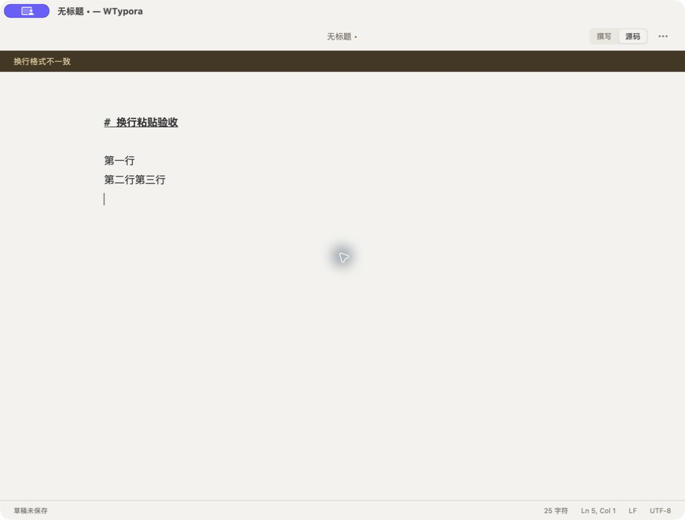
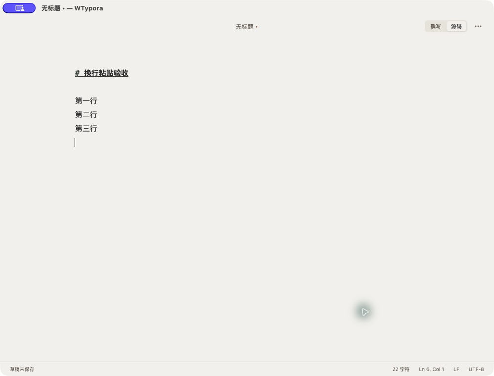

# 粘贴文本触发“换行格式不一致”修复报告

- 日期：2026-09-06
- 处理状态：代码已修复，自动检查与原生保存验收通过。
- 发布状态：未提交、未推送、未替换 `/Applications/WTypora.app`；已生成并运行独立原生验收包。

## 问题与根因

在 LF 文档中粘贴 `# 换行粘贴验收\r\n\r\n第一行\n第二行\r第三行\r\n`，原生窗口出现“换行格式不一致”，第二、第三行合并显示。

`createBuffer` 显式配置 CodeMirror `lineSeparator` 后，CodeMirror 只按该分隔符拆分剪贴板文本，其他换行符留在行内容中。序列化文本与会话声明的 LF/CRLF 不一致，Rust `codec::encode` 拒绝写入文件或恢复草稿。CRLF 文档粘贴 LF 文本也受影响。

## 修复范围

- `apps/desktop/src/editor/buffer.ts`：添加剪贴板输入过滤器，在 CodeMirror 拆行前把 CRLF、LF、独立 CR 转为当前文档的换行符。该 CodeMirror 过滤器也用于文本拖放；本次原生验收专门覆盖剪贴板。
- `apps/desktop/src/editor/paste.test.ts`：8 项真实 EditorView 粘贴事件回归，覆盖两种文档格式 × 四种输入格式，校验中文、emoji、空行、尾随空格、末尾换行、行数、撤销和重做。
- 保留原有只读限制、文件格式、Rust 写入校验和工作区其他改动。

## 修复前后对照

macOS 原生 WebView；1000 × 760 窗口；Newsprint 主题；源码模式；默认缩放；完全相同的合成测试文本。前图来自当前安装版，后图来自包含本次修复的独立验收包。

修复后无换行格式警告，第二、第三行分别显示，编辑器识别 6 行。截图阶段仍为未命名文档，状态栏“草稿未保存”不能当作恢复记录持久化成功的证据。

## 自动与原生验证

- 修复前回归：8 项中 6 项失败，2 项同格式粘贴通过。
- `npm run check`：退出码 0；语料保真、Prettier、TypeScript、ESLint、前端构建、Rust fmt、Rust 测试、Clippy 全部通过。Vitest 53 项通过；Rust 35 项通过、1 项测试子进程入口按设计忽略。
- 原生验收包：`npm run tauri -w @wtypora/desktop -- build --debug --bundles app --config '{"identifier":"com.wuming.wtypora.paste-validation","productName":"WTypora Paste Validation"}'` 成功，使用本地 ad-hoc 签名，未公证。
- 原生真实剪贴板：同一混合换行样例粘贴后无报错；保存完成后 UI 显示“已保存”。
- 磁盘验证：`/Users/wuming/Documents/无标题.md` 与预期文本逐字节相等，UTF-8 共 52 字节，5 个 LF、0 个 CR；验收副本见 [paste-lf.md](./evidence/paste-line-endings/paste-lf.md)。
- CRLF、撤销重做由自动回归覆盖；本次未执行浏览器 E2E 全套或单独核验恢复记录落盘。
- [完整检查日志](./evidence/paste-line-endings/check.log)、[原生打包日志](./evidence/paste-line-endings/build.log)。

## 发布边界

工作开始时 `main` 已领先 `origin/main` 1 个提交，且包含大量已有未提交修改（包括当前编辑器和原生打开流程）；本次仅增加五行粘贴修复及独立测试、报告。另有任务在同时更新工作区。

为保留现有工作，本次没有提交或推送这些其他改动，也未把混合工作区构建覆盖到正式安装目录。验收应用是本地工作区快照，不能标记为某个已发布提交。

- 验收应用：`target/debug/bundle/macos/WTypora Paste Validation.app`
- 验收可执行文件 SHA-256：`0a4a8e626364f6b91317f3063ba0632160c1649c63b6f5006407d57fea34adc9`
- 当前安装版仍需随后按项目发布流程更新。已在旧缓冲区粘贴的异常文本不会自动重写；升级后可重新粘贴原文本。
