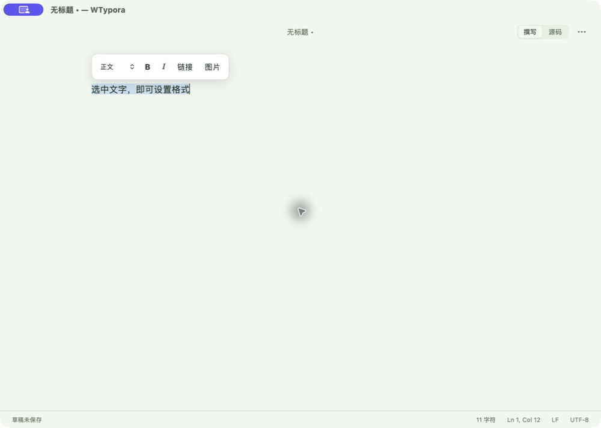

# 选区浮动格式菜单验收

日期：2026-09-08。

实现：选中文字后显示正文/H1～H6、加粗、斜体、链接、图片菜单；点击按钮保留选区，格式编辑独立撤销；支持链接/图片地址输入与本地图片选择，复用已有图床上传逻辑。撰写和源码模式均可用；支持 Esc、外部点击隐藏，滚动定位及窄窗口/夜间配色。

新增代码为 `editor/selectionToolbar.ts`、`editor/formatting.ts`、`editor/selection-toolbar.css`。控制器仅增加导入和扩展注册两处接入。本次未覆盖工作区原有功能改动。

| 检查项 | 状态与证据 |
| --- | --- |
| 基础检查 | 通过：`npm run check`，语料、Prettier、类型、ESLint、生产构建、Rust fmt/test/Clippy；前端 95 项通过；Rust 38 项通过、3 项按现有配置忽略（子进程入口和手动 PicGo 测试）。见 evidence/selection-toolbar/check.log。 |
| 浏览器交互 | 通过：`npm run e2e`，Chromium/WebKit 共 42 项通过，2 项可选性能测试按现有配置跳过。新增 6 项覆盖格式、撤销、地址校验、图片、菜单隐藏、鼠标选区、窄窗口夜间布局及本地文件选择后插入位置。见 evidence/selection-toolbar/e2e.log。 |
| 构建和签名 | 通过：`npm run tauri -w @wtypora/desktop -- build --debug --bundles app`；当前 ARM64 调试包及安装包均通过 `scripts/verify-macos-bundle.mjs`。未执行公证，构建提示公证环境未配置；本地交付未要求公证。Vite 保留现有大分块提示。 |
| 安装 | 通过：备份旧包后完整替换 `/Applications/WTypora.app`；构建与安装主程序 SHA-256 一致：`74fcc88b2b143f5477abe42b4892a1bca89acadabc2c3072bda3b53835b6f97f`。 |
| 启动 | 通过：实际进程来自 `/Applications/WTypora.app/Contents/MacOS/wtypora-desktop`，重启验收后仍运行。 |
| 安装版界面 | 通过：实际查看菜单及地址输入框；操作加粗、斜体叠加/取消、撤销、H1/H2、链接插入、Esc 隐藏；使用本机 HTTP 图片验证实际预览。截图见 evidence/selection-toolbar/installed-menu.png。 |
| 本地图片入口 | 系统文件选择器已实际打开并返回；真实图床上传未发送测试文件。自动化使用模拟上传响应，验证选区替换与撤销；桌面端观察到不支持文件的校验提示，正文保留。 |
| 工具异常 | 首次系统文件选择器关闭时，CUA 连续超时。只读进程采样显示主事件循环运行；重启仅含本次测试文字的窗口后恢复界面连接。未因此修改应用源码或清空用户数据。 |
| 条件联动 | 不适用：无原生接口、配置格式或数据库协议变更。 |
| Git | 未提交、合并或推送：无相应授权，工作区有大量先前未提交的改动。`git diff --check` 通过。 |
| 验证限制 | 真实外部图床上传未联机验收；需要沿用用户已配置图床。其余上述主菜单操作均已有执行证据。 |

