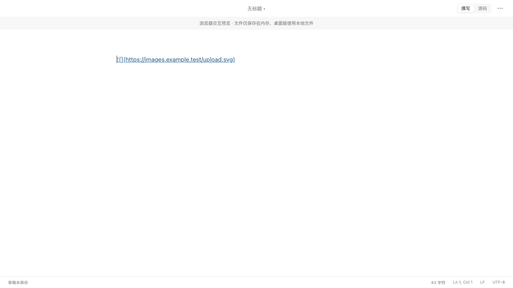
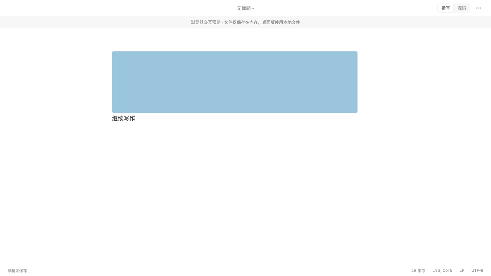

# 图片上传后自动换行

日期：2026-09-07。状态：已实现、测试、签名打包、安装并验证光标行为。未提交或推送。

## 行为

上传成功插入 Markdown 图片后，补一个换行，光标移至下一行开头；连续上传多张图片时，光标位于最后一张图片下方。上传期间如果用户已经移到别处，则保留当前选区并按变更映射位置。上传失败保持原文。图片插入作为独立撤销步骤，后续输入的撤销不再连带删除图片。

本次只修改上传插入逻辑及回归测试，保留工作区已有改动。

## 验证

| 检查 | 实际结果 |
| --- | --- |
| `npm run check` | 通过：格式、类型、lint、90 项前端测试、前端构建、38 项 Rust 测试通过 / 3 项既有忽略、Clippy；见 `evidence/upload-newline/check.log` |
| `npm run e2e` | 36 项通过，2 项可选性能采样跳过；见 `e2e.log` |
| 最终上传专项 | Chromium 与 WebKit 2 项通过；见 `regression.log`。模拟成功上传后不再点击编辑区，直接输入，验证图片仍可见且文字确实位于第 2 行 |
| 构建 | `npm run tauri -w @wtypora/desktop -- build --debug` 成功，Apple Development 签名，未做发行公证；见 `bundle.log` |
| 包与安装 | 构建及安装包均通过 `verify-macos-bundle.mjs`；完整安装至 `/Applications/WTypora.app`，旧包本地备份，二进制 SHA-256 一致；见 `installation.json` |
| 原生窗口 | 已安装主进程持续运行。临时文档上传返回后状态栏自动变为 Ln 2, Col 1；后续输入在第 2 行，磁盘文档验证为图片行 + 继续写作两行。已重新打开原文章 |
| 条件联动 | 无 IPC、系统权限或数据结构改动 |
| Git | 原有大量未提交及未跟踪改动，未提交、未推送 |

## 界面证据

浏览器中的上传前行为：链接仍为源码，图片未出现，回归断言失败。

修改后，上传完成可直接在新行输入，图片保持预览。

## 原生验收异常说明

原生调试面板尝试拦截单次上传返回，但拦截未生效：仅包含 3 个合成字节 `[1,2,3]` 的测试文件实际经当前图床配置上传并生成链接。没有使用用户图片、文章或其他私人内容。由于这不是有效图片文件，原生窗口显示图片加载失败；本次自动换行、选区位置及后续输入均验证成功。图床上的合成测试对象未删除。未修改图床配置；测试文档存于本地临时目录。

因此，真实有效图片的成功显示由浏览器回归验证，原生此次验收验证了真实上传返回后的换行和输入行为，并未把失败图片写成显示成功。
