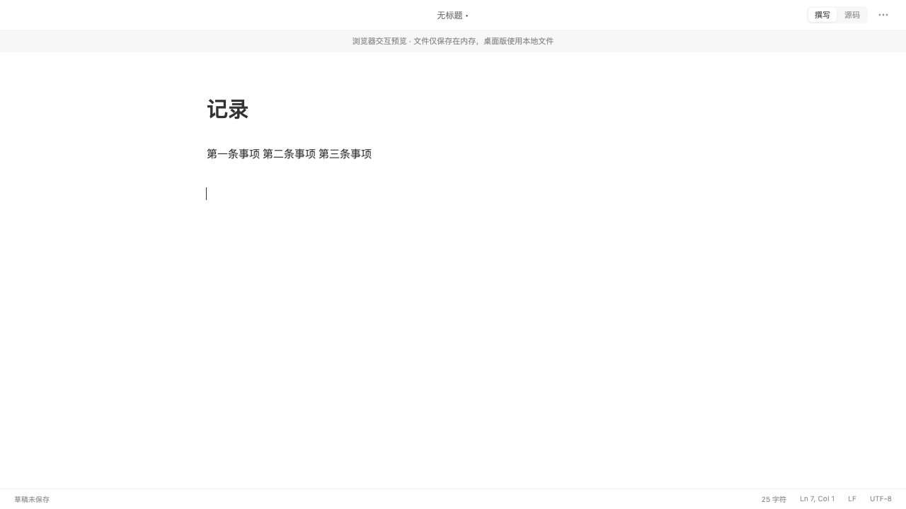
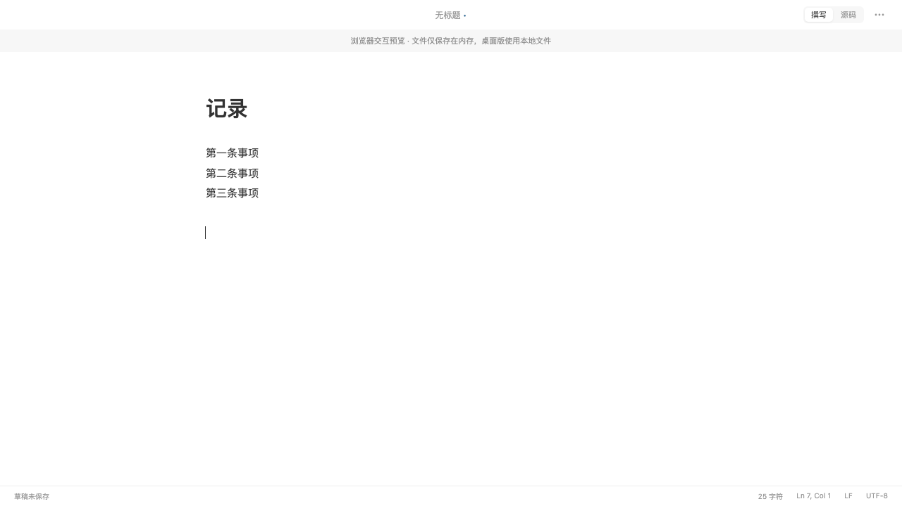
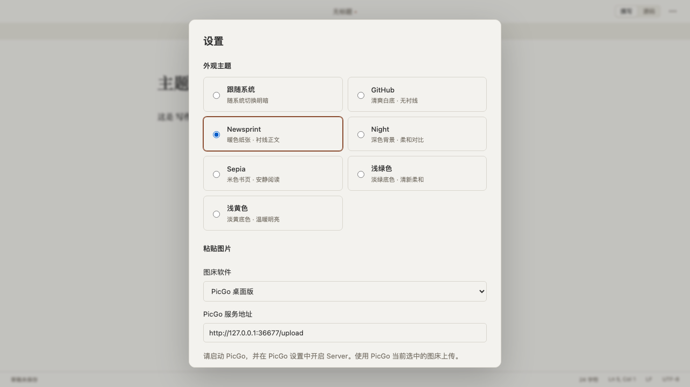

# 写作体验、窗口复用、主题与图片粘贴

日期：2026-09-05。代码与新版应用已交付本地，安装位置 `/Applications/WTypora.app`。未提交或推送：工作区已有上轮及更早的未提交改动，与本次修改共用同一文件和变更块，保持原有工作区，没有强行拆分提交。

## 问题与根因

观察了用户当前 WTypora 窗口，连续编号的多行文字在离开编辑块后合并为一行。脱敏测试使用「第一条事项 / 第二条事项 / 第三条事项」，按实际 Enter 输入再离开段落，修复前浏览器回归失败：预期三行，实际获得空格连接的一行。

Markdown 解析器保留了软换行，但块渲染容器的 `white-space: normal` 将换行折叠为空格。原始 Markdown 换行未丢失。本次让撰写区的段落和列表保留软换行，不向文档额外写入 Markdown 硬换行标记。回归还检查光标最终位于渲染段落下方，防止只验证文本而漏掉光标位置。

原生打开流程此前始终创建窗口。现在打开对话框、拖入和系统文件打开请求经统一路由：空白未命名窗口复用，有正文时另开；重复文件聚焦原窗口。前端在读取时冻结编辑，原生层验证会话所属窗口，文件成功读取后才释放旧会话。忙碌期间的打开请求排队处理，启动期间已排队的文件不会被后一个覆盖。

## 新功能

- 「… → 设置…」或 `Cmd+,` / `Ctrl+,`：GitHub、Newsprint、Night、Sepia、跟随系统。提供对应的颜色与字体样式，不导入 Typora 官方 CSS。切换即时生效，重启保留。
- 选择 PicGo 桌面版或 PicGo-Core。前者调用本机 `/upload`，后者通过参数数组调用程序的 `upload` 命令，不拼接 shell 命令。
- 只上传本次粘贴事件提供的图片，成功后在原粘贴位置插入 Markdown 图片链接。继续打字时跟踪插入位置；选中文字已被改写时停止插入，避免覆盖新内容。失败不会插入损坏的占位文本，并提示原因。
- 每张最大 10 MB，支持 PNG/JPEG/GIF/WebP/BMP。临时文件在上传完成或失败后清理。默认不自动上传，需要在设置中选择图床软件并在该软件中配置图床。

PicGo API 按[官方文档](https://docs.picgo.app/gui/guide/advance)实现。经典主题参考了[Typora 的主题使用方式](https://support.typora.io/About-Themes/)。

## 修复前后

环境：Chromium 浏览器开发演示，1280 × 720、浅色主题；测试正文为脱敏合成样例。

修复前：连续三行渲染成一行。

修复后：三行分别呈现；待 CodeMirror 完成布局测量，光标位于其下方的新段落。

主题和图床设置：

## 验证

- `npm run check`：语料校验、格式、类型、ESLint、前端测试、生产构建、Rust 格式/测试/Clippy 通过。后续仅调整了打开请求排队，补充对应测试，再次通过前端测试、ESLint、类型和原生打包。
- 最终 Vitest：9 个测试文件、44 项通过。
- Chromium / WebKit：18 项交互测试通过，2 项可选性能采样跳过。后续加强回车光标几何位置断言，两引擎均通过。
- Rust：32 项通过，1 项子进程测试入口按设计忽略。包括会话替换、文件读取失败保护、本机 HTTP 上传契约、错误/危险 URL 拒绝与临时文件清理。
- PicGo 上传使用本机模拟服务验证真实 HTTP 请求与临时图片读取；没有向用户真实图床上传文件。真实 PicGo 图床凭据与公网上传未验收。
- macOS 调试包构建与安装成功，已从访达启动，进程路径为 `/Applications/WTypora.app/Contents/MacOS/wtypora-desktop`。安装后电脑操作工具仍解析到过期应用标识，无法继续读取新版窗口，因此不声称完成了原生窗口和剪贴板端到端人工验收。浏览器与原生传输层测试分别通过。

## 安装清理

只清理 `com.wuming.wtypora.foundation` 对应的 WTypora 副本。旧构建包、安装缓存及旧应用移入废纸篓，保留一个新版 `/Applications/WTypora.app`。文档、草稿、恢复日志、备份目录均未清理。具体移动路径、数量和新版二进制 SHA-256 见 [安装清单](./evidence/writing-improvements/installation.json)。

## 当前边界

- 仍采用块级编辑与渲染；活动块显示 Markdown 标记，图片显示占位，源码模式可查看上传插入的链接。
- 尚未提供外部 CSS 主题导入；超大文档即时渲染性能没有本轮验收。
- 上传失败可在检查 PicGo 配置后重新粘贴；若上传已完成但选区被用户改写，图片可从 PicGo 中找回。
